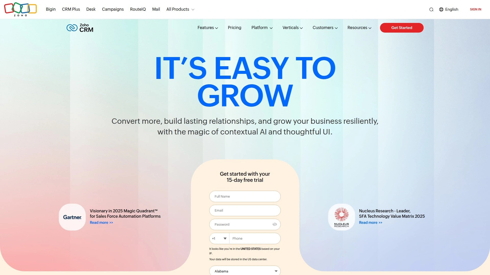

# 2025's Top 12 Best Sales CRM Platforms

Spreadsheets are where deals go to die. You know the drill—contact info scattered across email threads, follow-ups slipping through the cracks, and that sinking feeling when a hot lead goes cold because someone forgot to call back. Small business sales teams waste hours each week hunting for customer information, copying data between tools, and trying to remember who said what three weeks ago. The right CRM software flips this chaos into clarity, automatically tracking every interaction and reminding you exactly when to reach out. This guide walks through proven small business CRM platforms that actually reduce workload instead of adding another system to manually update, helping sales teams close more deals with less hassle and better visibility across the entire pipeline.

***

## **[Salesflare](https://salesflare.com)**

Intelligent sales CRM that fills itself automatically for B2B teams.

Salesflare earned its reputation as the number one user-rated CRM by solving the biggest problem sales teams face: keeping the system updated without drowning in data entry. The platform automatically captures customer information from email accounts, calendars, social media, phone calls, and even email signatures—then organizes everything into clean, actionable records. This reduces manual data entry by over 70 percent, letting sales representatives spend time actually selling instead of typing.

**Automation That Actually Works**

The system tracks every interaction with prospects and clients automatically, creating detailed histories without anyone lifting a finger. When someone on your team emails a prospect, takes a call, or schedules a meeting, Salesflare logs it instantly and keeps everyone in the loop. Automated reminders ensure follow-ups happen at the right time, preventing leads from going cold because someone got busy with other tasks.

Integration runs deep with Gmail, Outlook, and LinkedIn through native connections that feel like natural extensions of your workflow. The sidebar interface in your email inbox lets you manage contact records, view interaction histories, and update deals without ever leaving Gmail or Outlook. The LinkedIn Chrome extension adds prospects and finds verified email addresses directly from profiles, eliminating the need for separate prospecting tools.

Customizable dashboards provide real-time visibility into sales metrics that matter to your team. Visual pipelines make tracking deal progress intuitive, while team collaboration features share emails, files, and notes automatically across everyone working the same accounts. Mobile apps for iOS and Android ensure the entire team stays connected whether working from the office, home, or road. The platform scales with growing businesses through flexible permission settings and workflow automations that adapt to changing processes.

***

## **[HubSpot CRM](https://www.hubspot.com/products/crm)**

Free forever CRM platform with integrated marketing and sales tools for scaling companies.

HubSpot's free CRM includes unlimited users, unlimited data storage, and a surprisingly complete feature set that many businesses never need to upgrade from. The platform unifies customer data across marketing, sales, and service teams in one central location accessible to everyone who needs it. Unlike most "free trial" offerings that expire or limit critical features, HubSpot's free tier remains fully functional indefinitely with no credit card required.

Deal pipeline visualization helps teams track opportunities through custom sales stages with drag-and-drop simplicity. Contact management stores complete interaction histories including emails, calls, meetings, and website activity. Task assignment and reminders keep everyone accountable for follow-ups. Built-in email tracking shows exactly when prospects open messages and click links, providing perfect timing signals for sales outreach.

AI-powered features through Breeze Agents automate routine tasks, generate content, qualify leads, and provide research on companies and contacts. The free plan includes meeting scheduling tools, live chat widgets, ticketing for customer service, and basic reporting dashboards. Over 1,900 third-party integrations connect HubSpot to existing business tools through the app marketplace. For businesses needing advanced automation, detailed analytics, or custom reporting, paid tiers start reasonably and scale with company growth across Sales Hub, Marketing Hub, Service Hub, and Operations Hub products.

***

## **[Pipedrive](https://www.pipedrive.com)**

Visual pipeline CRM built specifically for salespeople managing deals.

Pipedrive focuses relentlessly on pipeline management with a visual interface that shows exactly where every deal stands at a glance. The customizable pipeline view uses drag-and-drop functionality to move deals through stages, making status updates feel natural instead of tedious. Sales teams immediately understand the system without extensive training because the interface mimics how people naturally think about sales progression.

**Built for Selling**

AI-powered features guide users through optimal next actions based on deal stage, previous interactions, and historical success patterns. Automated workflows handle repetitive tasks like lead assignment, follow-up reminders, and data updates, reducing administrative burden. The platform tracks all communications—emails, calls, meetings—automatically when connected to email and calendar systems.

Lead management includes both Kanban-style lead boards and list views that classify prospects by purchase likelihood and most recent activity date. This prevents leads from slipping through gaps in the process. Activity tracking records every customer touchpoint, ensuring smooth handoffs between team members and comprehensive visibility into relationship history.

Integration capabilities span over 400 third-party applications including Zapier, Google Analytics, Zoom, Slack, and various marketing automation platforms. Custom fields and custom pipelines allow tailoring the system to match unique business processes. Mobile apps provide full functionality on smartphones and tablets. Pricing starts at just over 12 dollars per user monthly for essential features, scaling up through advanced automation and professional tiers to enterprise packages for larger organizations requiring sophisticated customization.

***

## **[Zoho CRM](https://www.zoho.com/crm)**

Feature-loaded CRM for small businesses with extensive customization without coding.

Zoho CRM packs enterprise-level functionality into packages affordable for small businesses, with plans starting around 14 dollars per user monthly. The platform balances power with accessibility through an interface that looks complex initially but becomes intuitive with minimal learning time. Small teams get access to tools typically reserved for companies with dedicated IT departments, without requiring technical expertise to implement.

Sales automation handles repetitive tasks like lead assignment, follow-up scheduling, and workflow execution based on custom rules. Lead scoring ranks prospects by engagement and conversion likelihood, helping teams prioritize high-value opportunities. The multichannel approach captures leads from web forms, social media, email, phone, and live chat, centralizing all customer interactions regardless of origin channel.

Advanced analytics and customizable reports provide insights into sales performance, revenue trends, and team productivity. Real-time dashboards display critical metrics at a glance. The platform includes journey orchestration that maps customer experiences across touchpoints, blueprint tools for standardizing processes, and workflow automation for eliminating manual tasks.

Zoho integrates seamlessly with Google Workspace, Microsoft 365, Outlook, telephony services like Twilio, and productivity apps including Slack and Zapier. Security features include encryption, audit logs, IP restrictions, and two-factor authentication protecting sensitive customer data. The free plan accommodates up to three users with basic functionality, making it easy for micro-businesses to start using proper CRM without upfront investment.

***

## **[Freshsales](https://www.freshworks.com/crm/sales/)**

AI-powered CRM with built-in phone and chat for streamlined sales communication.

Freshsales by Freshworks integrates Freddy AI throughout the platform, providing intelligent deal insights, automated lead scoring, and predictive analytics that help sales teams prioritize efforts effectively. The AI evaluates leads based on engagement patterns, behavior data, and demographic information, assigning scores that identify which prospects deserve immediate attention versus longer nurturing sequences.

Built-in cloud telephony eliminates the need for separate phone systems or integrations. Sales representatives make calls directly from the CRM interface, with all conversations automatically logged and recorded for training and quality purposes. Chat functionality enables real-time website visitor engagement, capturing leads the moment they express interest. SMS capabilities round out omnichannel communication, letting teams reach prospects through preferred channels.

Email sequences automate personalized outreach campaigns across multiple touchpoints, with AI optimization suggesting best sending times and content variations. Custom workflows handle complex sales processes without manual intervention. The platform tracks deal health automatically, tagging opportunities as "Likely to Close," "Trending," "At Risk," or "Gone Cold" based on engagement signals and timeline analysis.

The Freshworks Marketplace connects the CRM to business applications across marketing, HR, finance, IT, and customer service departments, creating unified workflows. Pricing remains accessible for small to medium-sized businesses, starting at nine dollars per user monthly. The intuitive design minimizes learning curves, while competitive pricing makes sophisticated CRM capabilities available even to companies with tight budgets.

***

## **[Copper CRM](https://www.copper.com)**

Google Workspace native CRM that lives entirely inside Gmail and Calendar.

Copper differentiates itself by embedding completely within Google Workspace, making it feel like a natural extension of Gmail rather than a separate application to learn. For teams already living in Google's ecosystem, Copper eliminates the friction of switching between tools. The CRM sidebar appears directly in Gmail, showing contact details, deal information, and interaction history without leaving your inbox.

Task automation handles meeting scheduling, call logging, contact list updates, and file attachments through configurable triggers and actions. Workflow automations change deal stages, schedule follow-up tasks, update contact profiles, and route leads based on defined criteria. This reduces manual administrative work substantially, letting sales teams focus on relationship building and deal closing.

Customizable sales pipelines use drag-and-drop interfaces with unlimited stages representing any sales methodology. Visual pipeline views make tracking deal progress intuitive. Activity insights create visibility into team performance across different metrics for better accountability. Lead scoring identifies conversion-ready prospects automatically when using Business tier or higher plans.

Email templates standardize responses and improve efficiency for common communications. Custom reports leverage Copper's data to answer specific business questions. Integration capabilities include hundreds of popular business applications through native connections and middleware platforms. The platform targets small to medium businesses particularly those heavily invested in Google Workspace infrastructure, where the tight integration creates significant productivity advantages.

***

## **[Nimble CRM](https://www.nimble.com)**

Social CRM combining contact management with enriched business data and social profiles.

Nimble specializes in relationship-focused CRM that pulls together contact details, communication history, and social media intelligence into unified records. The auto-enrichment feature automatically updates contact information by pulling current data from social networks and business databases, saving hours of manual research and data entry. Profiles stay current without constant maintenance.

The browser extension lets users source leads, update records, and manage contacts from anywhere on the web—LinkedIn, company websites, online directories, or social platforms. This eliminates copy-pasting between browser tabs and CRM screens. Work happens wherever you already spend time online, with Nimble capturing information in the background.

Contact management works directly from your inbox, letting teams update and organize workflows without opening separate applications. Customizable kanban boards and list views track tasks, deadlines, and outcomes through visual project stages. Segmentation tools enable targeted email campaigns to specific audience groups, with engagement metrics showing open rates, click rates, and response patterns.

Pipeline management adapts to various business processes beyond traditional sales, supporting consulting workflows, agency client management, and project delivery tracking. Group messaging sends personalized emails at scale while maintaining individual touches. The platform works particularly well for small businesses, consultancies, and agencies needing unified contact management, email marketing, and pipeline automation in one simple tool priced around 25 dollars per user monthly.

***

## **[Insightly](https://www.insightly.com)**

Modern CRM combining sales automation with project management for end-to-end workflows.

Insightly bridges the gap between winning deals and delivering work by integrating project management directly into the CRM platform. After closing a sale, teams transition seamlessly into project execution mode using the same system, maintaining continuity and context. This unified approach prevents information loss that typically happens when customer handoffs occur between sales and delivery teams.

Contact management handles up to 100,000 contacts with complete journey tracking across the entire relationship lifecycle. The system differentiates between contacts as a database for storing people and organization profiles, and leads as potential customers being actively qualified. This structure supports more sophisticated sales processes where qualification status matters significantly.

Sales pipeline visualization tracks opportunities through custom stages with full visibility into deal progress, potential revenue, and close probability. Automated workflows trigger actions based on specific conditions, reducing manual task completion. Email integration logs communications automatically, building complete interaction histories. Military-grade encryption protects sensitive customer data at all security levels.

The platform scales from free plans supporting two users to comprehensive enterprise packages with advanced permissions and unlimited everything. Starting paid plans run around 29 dollars per user monthly, positioning Insightly in the affordable-to-moderate price range. Integration support includes Google Workspace, Microsoft 365, popular project management tools, and hundreds of applications through marketplace connections. Mobile apps provide iOS and Android access to full functionality.

***

## **[Capsule CRM](https://capsulecrm.com)**

Simple yet powerful CRM for small businesses with integrated project management.

Capsule prioritizes ease of use without sacrificing necessary functionality, creating a sweet spot for small businesses overwhelmed by enterprise CRM complexity. The customizable interface adapts to how teams actually work rather than forcing rigid structures. Contact management centralizes all information, documents, and correspondence related to customers in single, easily accessible locations.

Sales pipeline dashboards provide visual tracking and predictive insights into opportunities throughout the sales journey. Custom pipelines match unique business processes with unlimited flexibility in stage definitions and workflow rules. Social media tracking automatically updates contact records with current profile information, keeping data fresh without manual searches.

The project management module handles post-sale work directly within the CRM, eliminating the need for separate task management tools. Teams transition smoothly from winning deals to delivering projects while maintaining relationship context. Task assignment, deadline tracking, and progress monitoring happen in the same place customer data lives.

Integration capabilities include popular email marketing platforms like MailChimp, form builders such as Wufoo that feed leads directly into Capsule, accounting software including Xero and FreshBooks for invoice visibility, and many others through native connections. Pricing starts with free plans for up to two users, then scales from 21 dollars per user monthly through growth, advanced, and ultimate tiers. Cloud-based access works from any device, with dedicated iOS and Android mobile apps supporting on-the-go productivity.

---

## **[Agile CRM](https://www.agilecrm.com)**

All-in-one CRM with sales, marketing, and service automation on a single platform.

Agile CRM combines sales CRM, marketing automation, and customer service tools into one unified system, eliminating the data silos and integration headaches that plague multi-tool stacks. Small businesses get enterprise-level capabilities across the entire customer journey from first touch marketing through post-sale support, all managed from a single interface.

Marketing automation includes drag-and-drop campaign workflow builders, newsletter sending, autoresponders, and automated lead scoring. Web popups and surveys capture visitor information and feedback directly on websites and applications. Social media management monitors Twitter streams, schedules posts, and captures leads through social channels. Facebook, Twitter, and LinkedIn widgets integrate directly into contact pages.

The free CRM plan supports up to ten users with the complete feature set for sales and marketing, making Agile exceptionally generous for small teams getting started. Contact management provides 360-degree views with social data, call histories, email integration, and web analytics. Sales automation includes visual pipeline management, task tracking, appointment scheduling, and deal management.

Third-party integrations connect Agile to telephony services like Twilio, RingCentral, and VoIP.ms for calling capabilities. API access in REST, JavaScript, Java, PHP, C#, and Ruby enables custom integrations for technical teams. The platform scales as businesses grow, with paid tiers adding advanced features while maintaining the core functionality that makes adoption easy for non-technical users.

***

## **[Less Annoying CRM](https://www.lessannoyingcrm.com)**

Ultra-simple contact management CRM for small businesses at 15 dollars per user monthly.

Less Annoying CRM lives up to its name by stripping away complexity and focusing exclusively on what small businesses actually need: contact management, pipeline tracking, task management, and calendar integration. The single-tier pricing at 15 dollars per user monthly includes every feature—no upsells, no hidden charges, no confusing tier comparisons.

The straightforward interface requires minimal training, with most users becoming fully proficient within days rather than weeks. Contact management allows custom fields tailored to specific business needs. Pipeline visualization tracks deals from initial contact through closed-won status with clear stage progression. Task lists and calendar views keep follow-ups organized and prevent opportunities from falling through gaps.

Customer support stands out as a major strength, with free phone and email assistance available to all users including those on free trials. The help center provides comprehensive articles and video tutorials covering every system aspect. This support approach resonates with small business owners who lack dedicated IT resources but need reliable assistance when questions arise.

While Less Annoying CRM deliberately limits features compared to enterprise platforms, this focused simplicity becomes its greatest advantage for the target market. Small businesses, solo entrepreneurs, and micro-teams value ease of use and predictable costs over extensive customization and advanced analytics. The platform integrates with essential tools like Zapier, Mailchimp, Google Calendar, and Outlook Calendar, covering most small business connectivity needs without overwhelming options.

***

## **[Streak CRM](https://www.streak.com)**

Gmail-native CRM managing sales, support, and projects entirely inside your inbox.

Streak installs as a Chrome extension that transforms Gmail into a fully functional CRM without ever leaving your inbox. Every customer interaction happens where you already work, eliminating the constant context-switching that kills productivity in traditional CRM setups. Streak automatically captures email conversations, attachments, and relationship details directly from your Gmail activity.

Full customizability lets teams build pipelines for any use case beyond traditional sales—recruiting, customer support, project management, fundraising, event planning, or any process requiring stage-based tracking. Custom fields store exactly the data your business needs without forcing predefined structures. Pipeline views display deals, candidates, tickets, or projects in boxes that move through stages as work progresses.

Collaboration features optimize team data sharing so everyone sees the latest correspondence with clients, shared contacts, files, and communication threads. Permission levels control access appropriately across different team roles. Integration with Google Workspace leverages Calendar, Sheets, and Drive connections for powerful workflow capabilities.

Email power tools include snippets for repetitive message templates, mail merge for personalized bulk sending, send later for optimal timing, and email tracking showing exactly when recipients open messages. These features eliminate drudgery and provide crucial timing intelligence for follow-ups. Streak scales through open API access and hundreds of Zapier integration options. Pricing ranges from free plans for individual users through paid tiers adding advanced features for growing teams.

***

## **[Close CRM](https://www.close.com)**

Sales engagement CRM with built-in calling, email, and SMS for high-velocity teams.

Close targets small businesses and scaling sales teams that prioritize speed, efficiency, and revenue conversion over complexity. The platform integrates calling, email, and text messaging into a unified inbox, eliminating the tool-switching that fragments conversations across multiple platforms. Sales representatives communicate with prospects through any channel without leaving the CRM interface.

Built-in calling features include automatic call logging, power dialers for reaching large lead lists quickly, predictive dialers that connect reps only when calls answer, and premium phone numbers. Call assistants provide real-time guidance during conversations. These productivity tools help teams perform high-volume sales activities efficiently, reaching more prospects per day than traditional methods allow.

Email automation handles bulk campaigns while maintaining personalization through dynamic fields and smart sequences. Sales enablement tools provide templates, playbooks, and content repositories ensuring consistent messaging. Pipeline visualization tracks opportunities through customizable stages with clear metrics on conversion rates and deal velocity.

Workflow automation reduces manual administrative tasks, freeing representatives to focus on actual selling activities. Lead management handles import, scoring, routing, and nurturing automatically based on defined criteria. Reporting dashboards monitor individual and team performance against quotas and targets. The open API facilitates custom integrations beyond the 50-plus native application connections. Pricing starts at 29 dollars per user monthly for base plans, scaling through professional and enterprise tiers as feature requirements grow.

***

## FAQ

**How long does CRM implementation typically take for small business teams?**

Modern small business CRMs designed for ease of use typically require just hours to days for basic setup and team adoption, not weeks or months. Systems like Salesflare that automate data entry can be fully operational within one to two days, while platforms requiring more configuration might take a week. The key is choosing CRMs built specifically for small teams rather than enterprise solutions requiring consultant implementation.

**Do sales teams actually use CRM systems or do they become abandoned software?**

CRM adoption depends heavily on whether the system reduces workload or adds to it. Platforms that automate data capture from existing tools like email and calendar see high adoption because they work for sales teams instead of requiring constant manual updates. Systems that demand extensive data entry typically fail within months as teams revert to spreadsheets and memory.

**Can small businesses afford quality CRM software or are they priced for enterprises?**

Quality CRM software now exists at every price point from completely free options like HubSpot to ultra-affordable platforms around 15 dollars per user monthly. Many excellent small business CRMs cost less than 30 dollars per user monthly while providing capabilities that once required enterprise budgets. The cost of not using CRM—lost deals, forgotten follow-ups, departed employees taking customer knowledge—far exceeds these modest software investments.

***

## Conclusion

The right CRM transforms sales from chaos to system, turning scattered information into actionable intelligence that closes more deals with less stress. Modern platforms eliminate the data entry burden that killed previous CRM generations, automatically capturing interactions and reminding teams exactly when prospects need attention. **[Salesflare](https://salesflare.com)** particularly suits B2B sales teams tired of manual updates, automatically filling contact records from email, calendar, phone, and social interactions while providing the pipeline visibility and follow-up reminders that prevent opportunities from going cold. Its focus on automation over administration means teams actually use the system daily instead of abandoning it after the initial enthusiasm fades. Choose based on your team's size, existing tools, and whether you need basic pipeline tracking or comprehensive marketing integration—then watch response rates climb as nothing falls through the cracks anymore.

[76](https://en.wikipedia.org/wiki/Capsule_(CRM))
